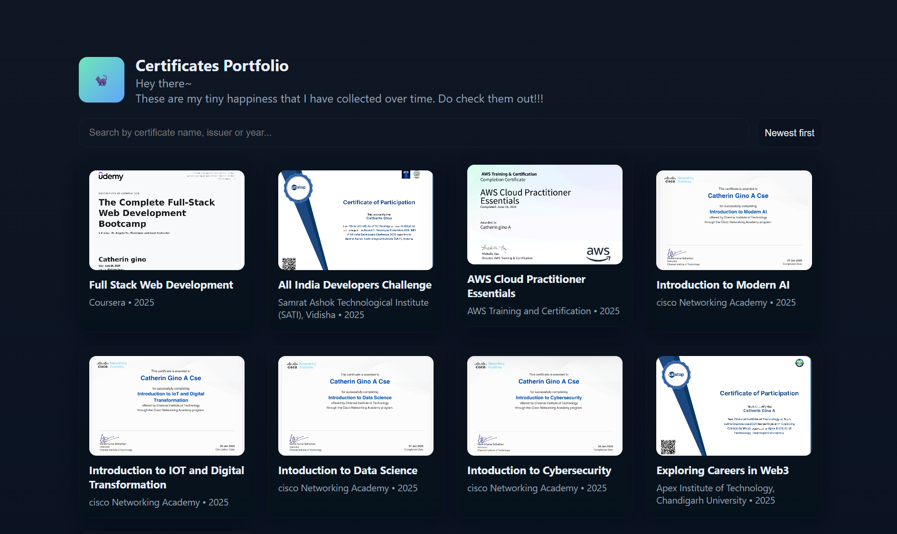

# 📜 Certificates Portfolio  

Hey there~ 👋  
These are my tiny happiness that I have collected over time. Do check them out! ✨  

This project is a simple, elegant **certificate portfolio website** built using HTML, CSS, and JavaScript. It lets you display your certificates in a neat gallery, with features like search, sorting, and a modal view for each certificate.  

---

## 🚀 Features
- 🎴 **Gallery view** of certificates with thumbnails and details  
- 🔍 **Search** by certificate name, issuer, or year  
- ⬇️ **Sort** certificates (Newest, Oldest, By Issuer)  
- 🖼️ **Full certificate view** in a modal with title, issuer, description, and year  
- 🔗 **Shareable links** (each certificate has a unique hash link)  
- 📥 **Download button** to save certificate images  
- 📱 **Responsive design** for all screen sizes  
- 🌌 Dark, modern UI design with smooth hover animations  

---

## 📂 Project Structure

        certificates-portfolio/
        │
        ├── index.html # Main portfolio page
        ├── images/ # Folder containing certificate images
        │ ├── cert1.png
        │ ├── cert2.png
        │ └── ...
        └── README.md # This file


---

## 🛠️ How to Use
1. **Clone this repository**  
   ```bash
   git clone https://github.com/CatherinGino/CertificatesPortfolio.git
   cd CertificatesPortfolio

2. **Add your certificates**
   ```bash
    Place your certificate images inside the /images/ folder.

    Update the certificates array in index.html with your own data:

    {
        id: 'cert-1',
        title: 'Full Stack Web Development',
        issuer: 'Coursera',
        year: 2025,
        desc: 'Completed a specialization on full stack development.',
        image: 'images/cert1.png'
    }

3. **Run locally**
    ```bash
    Just open index.html in your browser. No build step required.

4. **Deploy on GitHub Pages**
    ```bash
    Push your repository to GitHub

Go to Settings → Pages → select the main branch → /root

Your site will be live at:

https://CatherinGino.github.io/CertificatesPortfolio/

# 📸 Demo Screenshot



# ✨ Customization
Change the theme colors in index.html under the :root { ... } section

Replace the intro text in the header with your own message

Add/modify certificates easily by editing the JS array

# 📜 License
This project is open-source under the MIT License — feel free to use, modify, and share!

# 💌 Acknowledgments
Built with ❤️ using vanilla HTML, CSS & JavaScript

Hosted on GitHub Pages